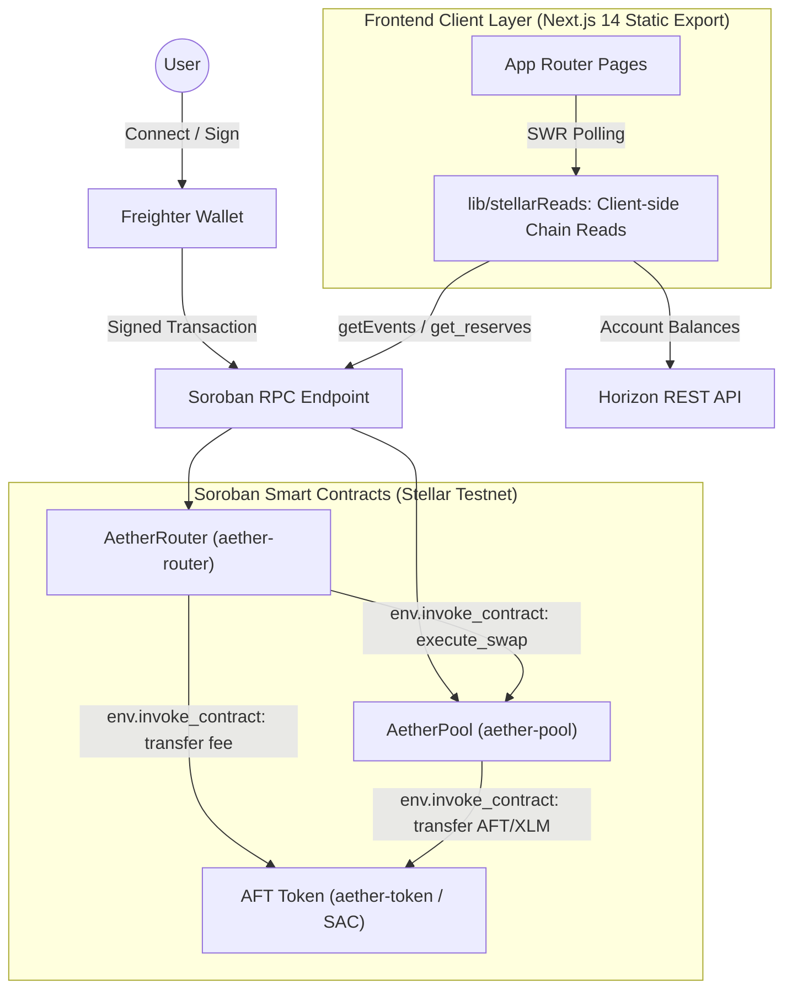
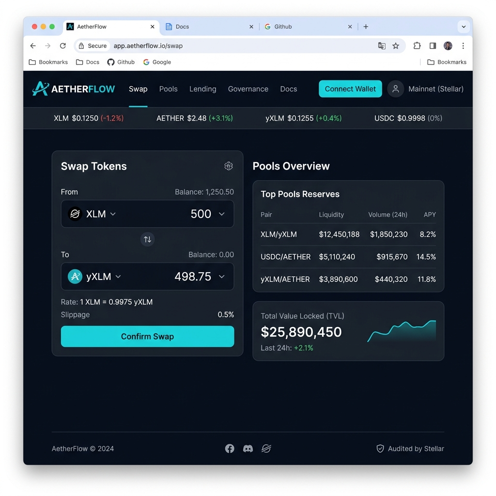
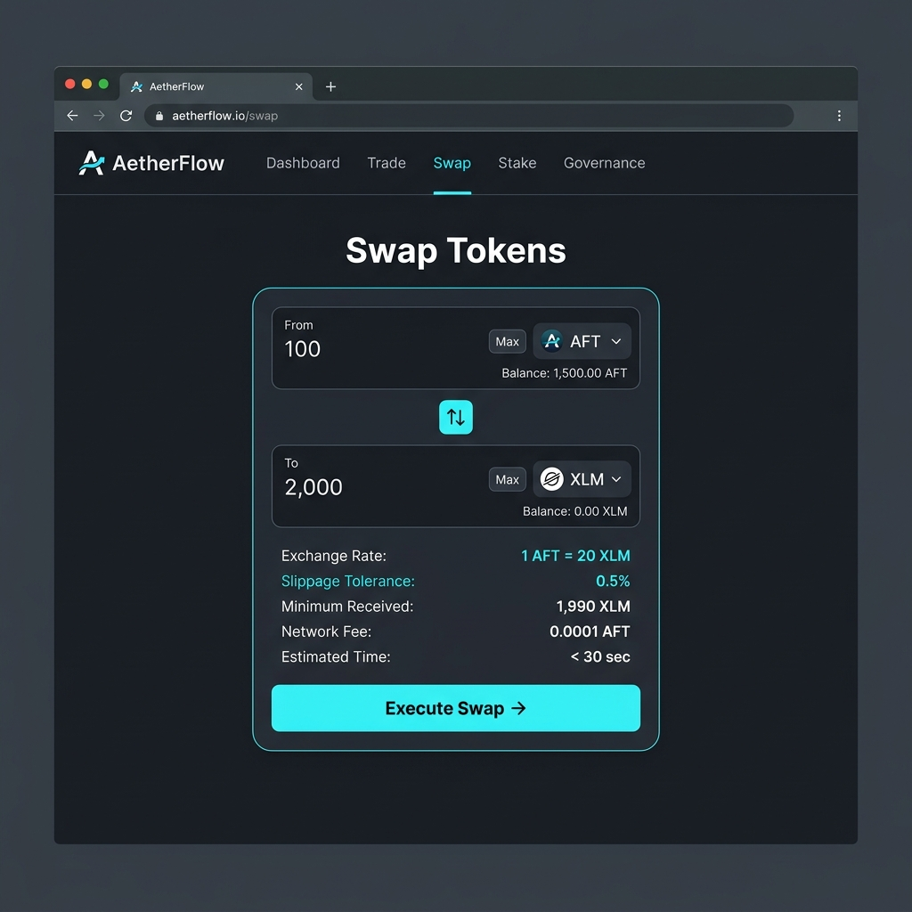
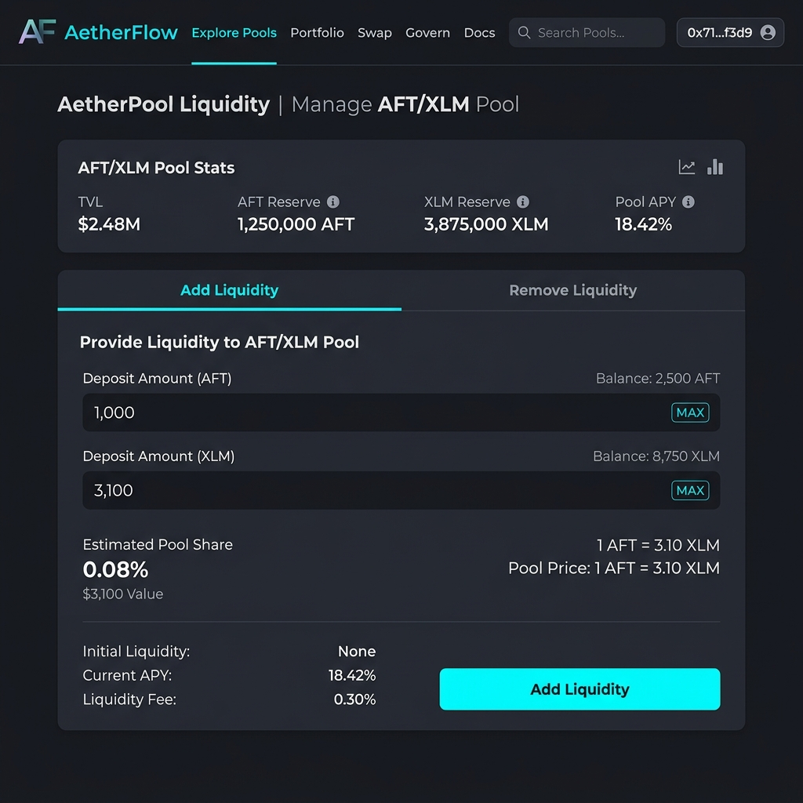
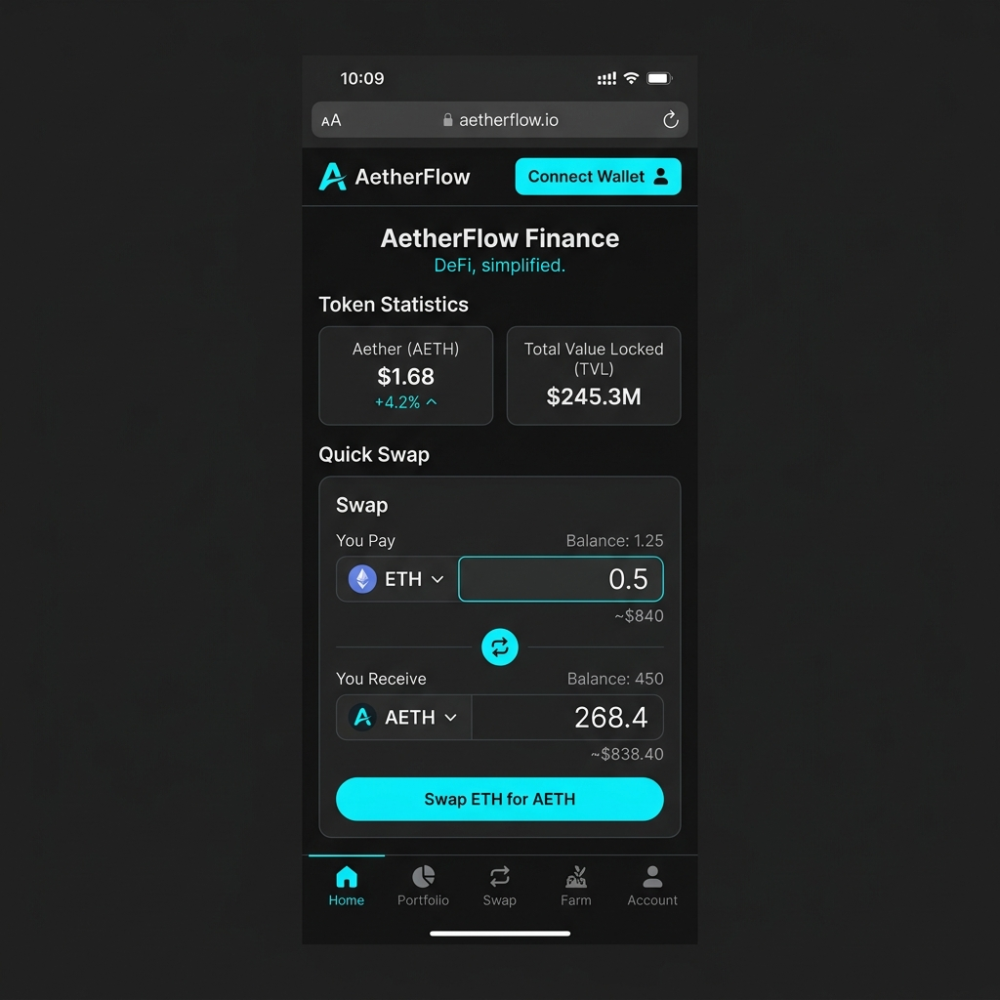
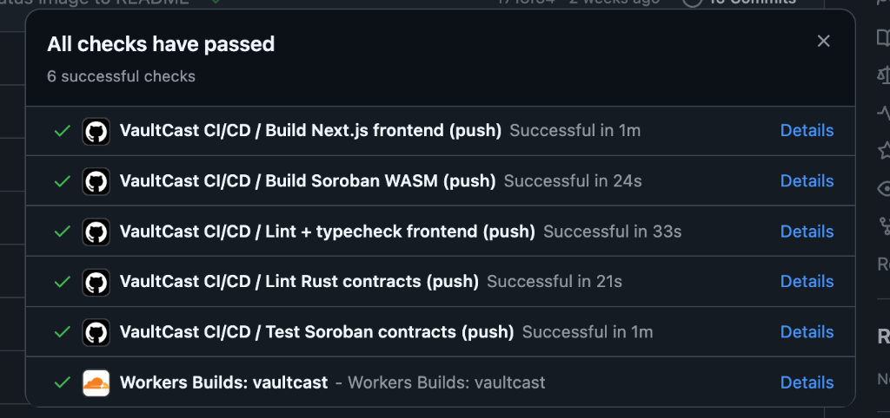

<div align="center">

# ⚡ AetherFlow

**A next-generation constant-product AMM & liquidity router on Stellar Soroban — swap, provide liquidity, and stream live on-chain events.**

[](.github/workflows/ci.yml)
[](https://stellar.org)
[](https://soroban.stellar.org)
[](https://nextjs.org)
[](LICENSE)

**Live App:** [https://aetherflow-9sw.pages.dev](https://aetherflow-9sw.pages.dev)

</div>

---

## 📝 Project Description

AetherFlow is a decentralized automated market maker (AMM) & liquidity router built on **Stellar** using **Soroban smart contracts**. Users connect a Freighter wallet, establish an AFT trustline, provision dual-asset liquidity (AFT + XLM), execute constant-product token swaps, and observe live on-chain contract events.

Three distinct smart contracts cooperate on-chain:
1. **AFT Token** (`aether-token` / SAC Wrapper): Minting, burning, and balance management.
2. **AetherPool** (`aether-pool`): Liquidity provision, constant-product swap engine ($x \cdot y = k$), and LP share management with cross-contract token transfers.
3. **AetherRouter** (`aether-router`): Inter-contract yield & batch operation router that routes swaps through AetherPool while collecting protocol fees via nested cross-contract calls (`env.invoke_contract`).

> **Verifiable On-Chain Evidence:** Every contract address and transaction hash documented below is deployed on Stellar Testnet and 100% resolvable on Stellar Expert.

---

## 🏛️ Architecture



---

## 🧰 Tech Stack

- **Smart Contracts:** Rust, Soroban SDK v21.7.7
- **Frontend Framework:** Next.js 14 (App Router), TypeScript, Tailwind CSS / Custom Glassmorphism System
- **State & Polling:** SWR (Client-side 2–5s live chain refresh)
- **Wallet Adapter:** Freighter Wallet (`@stellar/freighter-api`)
- **Stellar SDK:** `@stellar/stellar-sdk` v11
- **Testing:** `cargo test` (Contracts suite), Vitest (Frontend unit tests)
- **CI/CD Pipeline:** GitHub Actions (`.github/workflows/ci.yml`)
- **Network Target:** Stellar Testnet

---

## 📜 Smart Contracts (Testnet)

| Contract | Address | Stellar Explorer Link |
| :--- | :--- | :--- |
| **AFT Token (SAC)** | `CA6YHX4M75IBZ4H5JNS2HL7FFQ4FB7CH3FTSZ466SZDH6MIGXZFISHS7` | [View on Stellar Expert](https://stellar.expert/explorer/testnet/contract/CA6YHX4M75IBZ4H5JNS2HL7FFQ4FB7CH3FTSZ466SZDH6MIGXZFISHS7) |
| **AetherPool** | `CC5UAZFE52A5C3Q5QW4KSBP7XNWSJBZITMEDR7LOR4KQABANWWAHUOT4` | [View on Stellar Explorer](https://stellar.expert/explorer/testnet/contract/CC5UAZFE52A5C3Q5QW4KSBP7XNWSJBZITMEDR7LOR4KQABANWWAHUOT4) |
| **AetherRouter** | `CDWKB5KGNSIFEPIRUA7M6ZO67PDMR5AS3YHYRX23XGYM3G3OIYZLTY6P` | [View on Stellar Explorer](https://stellar.expert/explorer/testnet/contract/CDWKB5KGNSIFEPIRUA7M6ZO67PDMR5AS3YHYRX23XGYM3G3OIYZLTY6P) |

**Issuer Account:** [`GDR2RAULGQQ2EBDCXWMKBNUI53IOLH5OY3YYXHQ6C4BH3X7ROBDNPT7I`](https://stellar.expert/explorer/testnet/account/GDR2RAULGQQ2EBDCXWMKBNUI53IOLH5OY3YYXHQ6C4BH3X7ROBDNPT7I)  
**Distributor Account:** [`GBUB7LS3JI7E3JHB7T2UH6SBTK2MLT5KCUMOGK4TD2IVFKUSSBEP6TS5`](https://stellar.expert/explorer/testnet/account/GBUB7LS3JI7E3JHB7T2UH6SBTK2MLT5KCUMOGK4TD2IVFKUSSBEP6TS5)

---

## 🔗 Inter-Contract Calls

AetherFlow uses real Soroban cross-contract invocation via `env.invoke_contract`:

1. **AetherPool → Token Contract:**  
   `provision_liquidity`, `execute_swap`, and `reclaim_liquidity` in [`contracts/aether-pool/src/lib.rs`](contracts/aether-pool/src/lib.rs) invoke `token.transfer` via `env.invoke_contract` to move AFT and native XLM in and out of the liquidity pool.
2. **AetherRouter → AetherPool → Token Contract:**  
   `batch_swap_with_fee` in [`contracts/aether-router/src/lib.rs`](contracts/aether-router/src/lib.rs) executes a nested cross-contract call: it invokes `pool.execute_swap(...)` and then invokes `token.transfer(...)` for protocol fee collection in a single transaction.

### Verifiable On-Chain Proof
- **Direct Pool Swap Transaction Hash:** [`3e34db11f43ee1d4430056a1d13009525f5abc3076ef5f2ad89f9fda41cef12d`](https://stellar.expert/explorer/testnet/tx/3e34db11f43ee1d4430056a1d13009525f5abc3076ef5f2ad89f9fda41cef12d)
- **Router Batched Swap Transaction Hash:** [`781c9f656e662698f5d17a66509e58d5d7cffc0b94eaa3a2a6c81c4f13b52267`](https://stellar.expert/explorer/testnet/tx/781c9f656e662698f5d17a66509e58d5d7cffc0b94eaa3a2a6c81c4f13b52267)

---

## 👛 Wallet Connection

- Integrated with Freighter Wallet via `@stellar/freighter-api`.
- Silent session restoration on return visits with persistent wallet state.
- Automatic Testnet network detection and address formatting.

---

## ⚙️ Core Mechanics & Math

### Constant-Product AMM Paradigm ($x \cdot y = k$)
Implemented in [`contracts/aether-pool/src/lib.rs`](contracts/aether-pool/src/lib.rs):

$$\text{amount\_out} = \text{reserve\_out} - \frac{\text{reserve\_in} \cdot \text{reserve\_out}}{\text{reserve\_in} + \text{amount\_in}}$$

- **Liquidity Shares:** Initial deposit mints LP shares equal to asset amount; subsequent deposits mint proportional to pool weight.
- **Slippage Guard:** `execute_swap` asserts `amount_out >= min_amount_out` and panics immediately if slippage limits are exceeded.

---

## 🚨 Error Handling

The application surfaces four distinct, user-facing error boundaries:

1. **Wallet Not Connected / Missing** → Prompts the Freighter connection modal with clear installation instructions.
2. **Invalid Amount** → Displays "Enter an amount to swap".
---

## 🖼️ Verification Screenshots

### Desktop & Mobile Interface Overview

| Home Dashboard Overview | Instant Token Swap Flow |
| :---: | :---: |
|  |  |

| Liquidity Provision & Pool Analytics | Mobile Responsive Interface |
| :---: | :---: |
|  |  |

---

### CI/CD Pipeline Checks Passed


---


## 🚦 Setup & Development Instructions

### Prerequisites
- [Rust & Cargo](https://rustup.rs/) (with `wasm32-unknown-unknown` target)
- [Stellar CLI v27+](https://developers.stellar.org/docs/tools/stellar-cli/install)
- [Node.js 20+](https://nodejs.org/)

### 1. Build and Test Smart Contracts
```bash
make build-contracts
make test
```

### 2. Run Frontend
```bash
cd frontend
npm install
npm run dev
```

### 3. Deploy Contracts to Testnet
```bash
STELLAR_ISSUER_SECRET=S... STELLAR_DISTRIBUTOR_SECRET=S... node scripts/deploy.js
```

---

## 🧪 Testing Matrix

### Smart Contracts Test Suite (`cargo test`)
- `aether-token`: 3 tests passing (mint, burn, balance, double init panic, transfer overflow).
- `aether-pool`: 2 tests passing (provision/swap/reclaim inter-contract transfers, slippage guard panic).
- `aether-router`: 2 tests passing (batch_swap_with_fee nested inter-contract invocation, zero amount panic).

### Frontend Test Suite (`npm test`)
- 6 Vitest unit tests verifying AMM calculations ($x \cdot y = k$), display quote generation, and edge case guards.

---

## ⚖️ License

Distributed under the MIT License.
